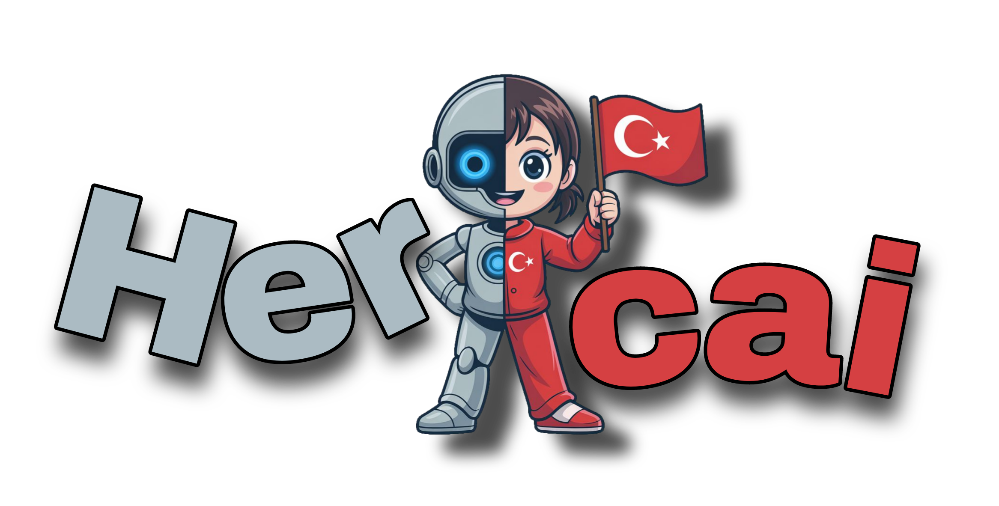

<p align="center"> <a href="#"> </a></p> 
<a href="https://www.npmjs.com/package/nyro">
<p align="center"> 

<span align="center">Powered By Nyro</span>
</p>
</a>
<a href="https://www.npmjs.com/package/nexorm">
<p align="center"> 
<span align="center">Recommends NexORM</span>

</p>
</a>
<p align="center"> <a href="https://render.com?ref=hercai"> </a> </p>
<p align="center">      <a href="https://discord.gg/luppux" target="_blank">  </a><a href="https://www.buymeacoffee.com/beykant" target="_blank"></a></p>


# [Herc.ai](https://discord.gg/luppux)

> **A powerful library for interacting with the [Herc.ai](https://discord.gg/luppux) API.**

> **[✨ Do You Want to Increase Your Herc.ai Limits? Click Here.](https://discord.gg/luppux)**

#
### ❔ [Support](https://discord.gg/luppux)
### 📂 [NPM](https://npmjs.com/hercai)
### 📝 [Github](https://github.com/Bes-js/herc.ai)

#

**📂 Installation**
```bash
npm i hercai
yarn add hercai
pnpm add hercai
bun add hercai
```
#
# Quick Example

**Example Client For TypeScript;**
```ts
/* Import Package */
import { Hercai } from "hercai";

/* Initialize Client For Free Tier */
const hercai = new Hercai();

/* Initialize Client For Custom API Key */
const hercai = new Hercai({
    apiKey: 'YourSecretApiKey'
});
```

**Example Stream Completions For TypeScript;**
```ts
import { Hercai } from "hercai";
const hercai = new Hercai();

hercai.chat.completions.create({
    messages: [
        {
            role: 'user',
            content: 'Hi, How Are You?'
        },
        {
            role: 'assistant',
            content: 'I\'m just a computer program, so I don\'t have feelings, but thanks for asking. How can I assist you today?'
        },
        {
            role: 'user',
            content: [
                {
                    type: 'image',
                    image_url: {
                        url: 'base64:....'
                    }
                },
                {
                    type: 'text',
                    text: 'What Do You See In This Picture?'
                }
            ]
        }
    ],
    model: 'google/Gemma-3-12b-it',
    stream: true
}).then(async(streamResponse) => {

    for await (const chunk of streamResponse) {
        console.log(chunk.reply);
    }

});
```
#


**Example Completions For TypeScript;**
```ts
import { Hercai } from "hercai";
const hercai = new Hercai();

hercai.chat.completions.create({
    messages: [
        {
            role: 'user',
            content: 'Hi How Are You?'
        },
        {
            role: 'assistant',
            content: 'I\'m just a computer program, so I don\'t have feelings, but thanks for asking. How can I assist you today?'
        },
        {
            role: 'user',
            content: 'What Is The Best Programming Language?'
        }
    ],
    model: 'openai/GPT-4-32k-0613'
}).then((response) => {
    console.log(response.reply);
});
```
#


**Example Draw Image For TypeScript;**
```ts
import { Hercai } from "hercai";
import * as fs from 'fs';
const hercai = new Hercai();


hercai.images.generations({
    prompt: 'A Photo Of An Astronaut Riding A Horse.',
    negative_prompt: '',
    model: 'blackforestlabs/Flux-1.0',
    size: '1024x1024',
    seed: '45',
    response_format: 'buffer',
    steps: 50,
}).then(async(ImageBuffer) => {
    
    fs.writeFileSync('./hercai.png', ImageBuffer);

});
```
#


**Example Audio Speech For TypeScript;**
```ts
import { Hercai } from "hercai";
import * as fs from 'fs';
const hercai = new Hercai();


hercai.audio.speech.create({
    model: 'openai/Echo',
    input: 'Hello, how are you?',
    format: 'mp3',
}).then(async(AudioBuffer) => {
    
    fs.writeFileSync('./hercai.mp3', AudioBuffer);
    
});
```
#


**Example Get Models For TypeScript;**
```ts
import { Hercai } from "hercai";
const hercai = new Hercai();

/* For Completion Models */
hercai.chat.models.retrieve().then((models) => {
    console.log(models);
});

/* For Image Models */
hercai.images.models.retrieve().then((models) => {
    console.log(models);
});

/* For Audio Models */
hercai.audio.models.retrieve().then((models) => {
    console.log(models);
});
```
#


**Example Get Rate Limits For TypeScript;**
```ts
import { Hercai } from "hercai";
const hercai = new Hercai();

/* Get Rate Limits By Category */
hercai.ratelimits.retrieveByCategory('image').then((rateLimits) => {
    console.log(rateLimits);
});

/* Get Rate Limits By Model For Your Usage */
hercai.ratelimits.retrieveByModel('openai/GPT-4-32k-0613').then((rateLimits) => {
    console.log(rateLimits);
});
```
#


**Example System Prompt For TypeScript;**
```ts
/* 
  ⚠️ System Prompt Is Not Supported By All Models.
*/
import { Hercai } from "hercai";
const hercai = new Hercai();

hercai.chat.completions.create({
    messages: [
        {
            role: 'system',
            content: 'You are a helpful assistant.'
        },
        {
            role: 'user',
            content: 'Hi How Are You?'
        }
    ],
    model: 'openai/GPT-4-32k-0613'
}).then((response) => {
    console.log(response.reply);
});
```
#
# API Reference

```ts
/* Chat Completions */
https://hercai.onrender.com/v1/chat/completions - POST

/* Image Generations */
https://hercai.onrender.com/v1/images/generations - POST

/* Audio Speech */
https://hercai.onrender.com/v1/audio/speech - POST

/* Models */
https://hercai.onrender.com/v1/chat/models - GET
https://hercai.onrender.com/v1/image/models - GET
https://hercai.onrender.com/v1/audio/models - GET

/* Rate Limits */
https://hercai.onrender.com/v1/ratelimits - GET
https://hercai.onrender.com/v1/ratelimits/:model - GET


```

# Credits
 
**Made by [FiveSoBes](https://github.com/Bes-js) And [Luppux Development](https://github.com/Luppux)**


# Contact & Support

[](https://discord.gg/luppux)